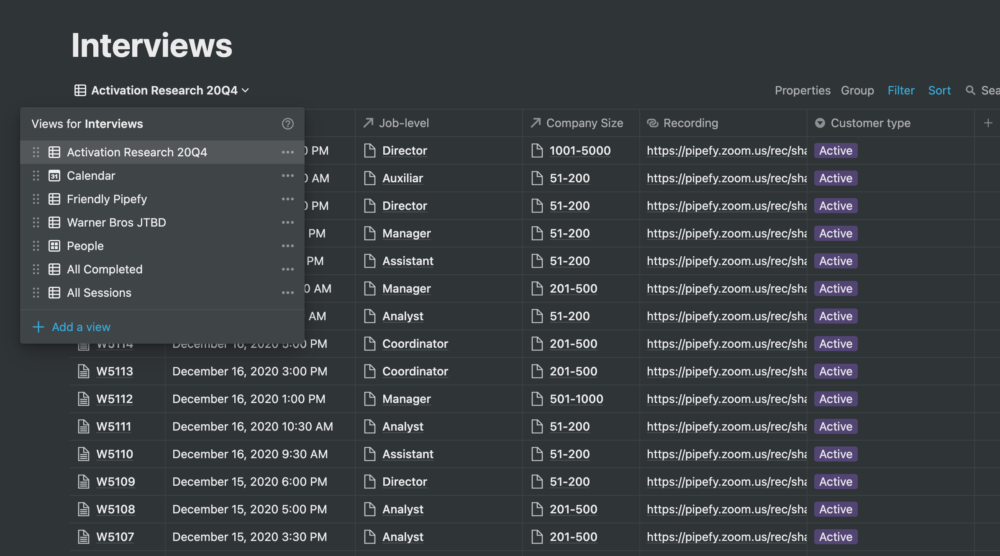

# Activation & Retention Research — B2B SaaS

**Domain:** B2B SaaS — Process Management Platform
**Type:** Mixed-Methods UX Research
**Year:** 2020
**Role:** Lead UX Researcher

---

| | |
|---|---|
| **100** interviews across 2 phases | **259** documented findings |
| **7** competitors benchmarked | **3** user segments identified |
| **2** onboarding strategies recommended | **2×** ARR growth the following year |

---

A workflow management platform was losing users before they ever reached their first meaningful moment with the product. Retention was trending down, and the team didn't know whether the problem lived on the website, in the signup flow, or inside the product itself. My job was to find out — and define what "activation" should actually mean for this product.

## What I did

Over **6 months**, I ran a two-phase research program totaling **100 interviews** and **259 documented findings**.

**Phase 1** focused on potential customers — people who had signed up but never converted. I interviewed **64 participants** across the US and Canada, ranging from small teams to large enterprises, all in HR or Finance roles. Sessions included side-by-side comparisons with **7 competitors** across the HR, Finance, and horizontal workflow tool categories. Research strategy was updated weekly as patterns emerged.

Mid-project, a benchmark session with an external growth advisory firm reframed the research focus. Best-in-class SaaS products defined activation through three components: a time window, persona-specific paths, and High-Value Actions tied to retention. That framework became the backbone for Phase 2.

**Phase 2** focused on active users and recently churned customers — **36 interviews** concentrated in the final weeks of Q4 — to identify which specific product actions predicted long-term retention.

## What we found

The headline finding was that one onboarding model couldn't serve all **3 user segments**:

- **Small companies** don't arrive with processes — they build them inside the product. They onboard faster and activate more than any other segment.
- **Medium companies** have semi-mature workflows they need to transfer. Their friction is about migration, not discovery.
- **Large companies** don't self-sign-up. They evaluate from the outside, need to see the product before touching it, and require an internal business case before requesting a demo.

Two other findings cut across all segments. First, users consistently needed to sketch their process on a whiteboard or in a separate tool before building anything in the product — a **1–2 week offline phase** that product analytics couldn't see, but that determined whether they ever came back. Second, High-Value features (automation, process customization, templates) were consistently invisible to users who hadn't received a demo. Self-service discovery was not a reliable path to activation.

The quantitative picture confirmed it: the top problem theme across **259 findings** was *lack of fit to use case* (**58 instances**), followed by *signup barrier* (**53**) and *hidden high-value actions* (**45**). The walkthrough — meant to guide users — was the most-cited source of in-product frustration.

## What changed

The research provided the evidence base for a fundamental shift in product and go-to-market strategy: **2 distinct onboarding paths** — a self-service PLG path for smaller teams and a sales-assisted model for enterprise.

In 2021, the company launched a redesigned product that directly addressed the activation friction identified — simplified onboarding, surfaced high-value features, and dropped the blocking walkthrough. The platform **doubled its ARR** that year and raised a **$75M Series C**, with investors citing its ability to scale from a single team to an entire enterprise as a primary rationale.
